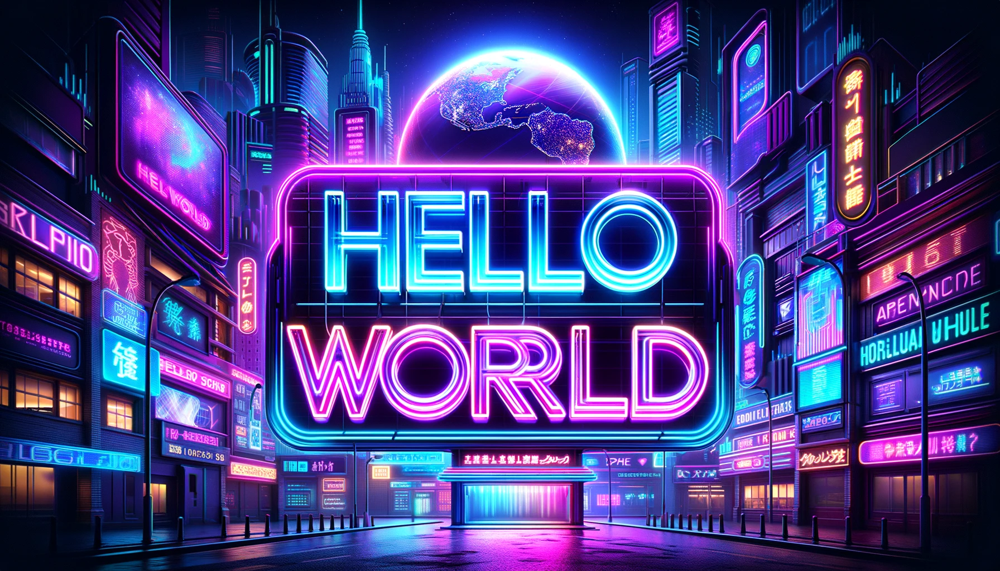

## Hello, World ! 

I began my career as a Java developer in 2022. I enjoy learning, thinking, 
and collaborating with a group of people to create cool stuffs. 

I'm a fan of LeetCode now I'm running into Daily Leetcode Challenge, Trying to attend AtCoder.
Currently, I'm studying front-end development with React, aiming to become a full-stack developer.

## Get in Touch
[LinkedIn](https://linkedin.com/in/rickyhsieh0302/)

## 🛠️ **Building projects with:**

More

 

  

    
     
    
  

